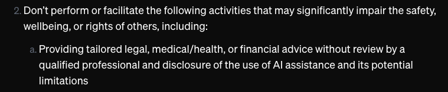

### Trends
| OPL: OpenAI, Pinecone, LangChain

### OpenAI
Sites: 
* [platform](https://platform.openai.com/)
* [tokenizer](https://platform.openai.com/tokenizer)
* [pricing](https://openai.com/api/pricing/)
* [examples](https://platform.openai.com/docs/examples)

### HuggingFace
Sites:
* [main](https://huggingface.co/)
* [models](https://huggingface.co/models)
* [datasets](https://huggingface.co/datasets)
* [spaces](https://huggingface.co/spaces)

1. Create API key from [project](https://platform.openai.com/api-keys) or [organisation](https://platform.openai.com/organization/api-keys), they are the same. Then add a .env file to project root:
   ```bash
   mkdir models
   touch .env
   cat libs/dotenv_config.txt > .env
   ```
1. [First Experiment](./labs/1.first_langchain_programe.ipynb)

### Core AI Technology
* Natual language processing (NLP), started long way back of 1965, followed by a big boost of RNN (Recurrent neural networks).
   * Characteristics of RNN: 
      1. Sophisticaed deep learning algorithms, model loops back on itself, an iterative process.
      1. Good at finding patterns and relationships among sequences and data, like words or tokens.
   * Problem with RNN:
      1. Vanishing gradient, because when outputs are looped back, its weight get very small.
      1. Means model can quickly lose effectiveness, worse with larger datasets.
      1. Interim solution: Long short-term memory networks (LSTMs), providing a memory cell to adjust weights through the system. But still not ideal.
* Attention Papers
   1. [Neural Machine Translation by Jointly Learning to Align and Translate (2014)](https://arxiv.org/pdf/1409.0473): Translation
   1. [Pointer Networks (2015)](https://arxiv.org/pdf/1506.03134)
   1. [Hierarchical Attention Networks for Document Classification (2016)](https://www.cs.cmu.edu/~./hovy/papers/16HLT-hierarchical-attention-networks.pdf): Classification
   1. [Attention is all you need (2017)](https://arxiv.org/pdf/1706.03762): BREAKTHROUGH: Transformer Model
      * Not RNN, but based on attention mechanism.
      * Process all tokens of input sequence simultaneously, means more efficient and can use GPU.
      * Achieved a strong results of translation.
      * Lead to known models like BERT and GPT, which are pretrained with public data like Wikipedia and Reddit, that can be fine tuned with domain subject knowledge.
      * Further inspired image generation: Vision Transformer (ViT), Graph neural network, Multimodal applications (DALL-E, Stable Diffusion, Midjourney).
* Risks
   1. Biases and discriminations, caused by training data being biased, synthetic. Problem appears in hiring, credit approval, facial recognition.
   2. LLM is a black box, impossible to understand the model, with hundreds of billions of parameters. OK for some cases, like marketing, concerning for regulated industries, like financial services and health care
   3. Data security concern: API sending transparent data, Breaches, Private clouds costing, data residency requirements, prompt injections/jailbreaks.
   4. Hallucinate: providing details that doesn't exist, paper: [Trapping LLM "Hallucinations" Using Tagged Context Prompts](https://arxiv.org/pdf/2306.06085)
   5. Intellectual property, who owns the outcome?
* Policies of LLM Apps
   1. [OpenAI Usage Policies](https://openai.com/policies/usage-policies/) </br>
      
* Models
   1. ChatGPT 3.5 & 4.0 (Microsoft)
   2. PaLM2, Bard, Gemini (Google)
   3. Claude2 (Anthropic)
   4. Cohere
   5. Llama2 (Meta) **open source**
   6. Dolly (Databricks)
* Fine Tuning an LLM
   * Considerations:
   1. Relevant dataset
   2. Security, guardrails
   3. PII
   4. Unique purpose
   5. Cost
   * General Process:
   1. Preprocessing (correctiongs, outliers, duplications)
   2. Model selection
   3. [Fine tuning](https://platform.openai.com/docs/guides/fine-tuning) (Classification, Conditional Generation)
      ```
      # openai cli is available after openai python package is installed
      (venv) vscode ➜ /workspaces/LangChain (main) $ openai tools fine_tunes.prepare_data -h
      usage: openai tools fine_tunes.prepare_data [-h] -f FILE [-q]

      options:
      -h, --help            show this help message and exit
      -f FILE, --file FILE  JSONL, JSON, CSV, TSV, TXT or XLSX file containing prompt-completion examples to be analyzed.This should be the local file path.
      -q, --quiet           Auto accepts all suggestions, without asking for user input. To be used within scripts.
      ```
   4. Evaluation and testing
### Prompt Engineering
   1. zero/one/few shot learning, by providing no/one/few examples for the LLM to figure out the answer. Paper: [Lost in the Middle: How Language Model Use Long Contexts](https://arxiv.org/pdf/2307.03172)
   2. [LangChain prompt template](https://python.langchain.com/v0.2/docs/concepts/#prompt-templates)
   3. Output Parsers
      * get_frmat_instructions()
      * parse()
      * parse_with_prompt
   4. Serialization